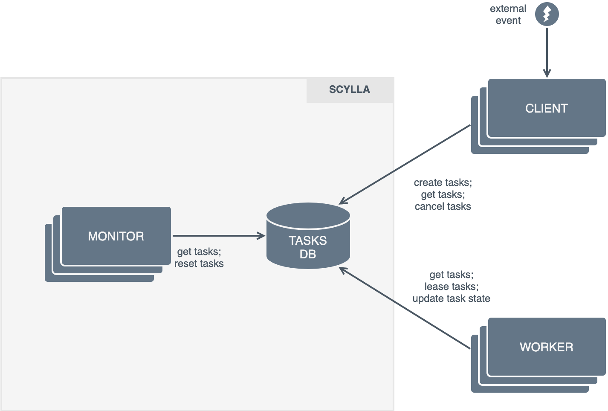
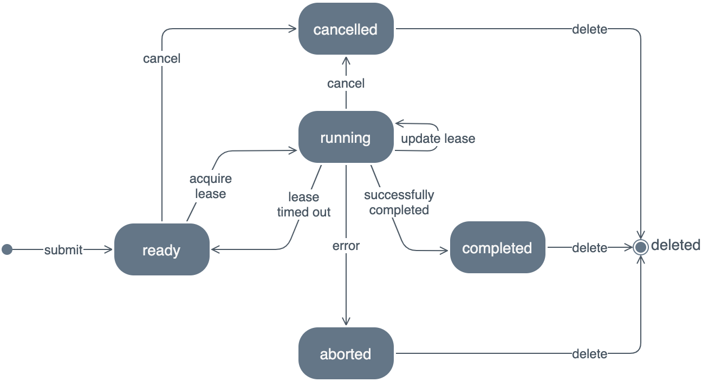

[](https://github.com/kindredgroup/scylla/actions/workflows/build.yml)
[](https://app.codecov.io/gh/kindredgroup/scylla)

Scylla
===


# Introduction
Scylla (a legendary sea monster with many tentacles) is a **standalone, general-purpose task scheduling system**.

<br/>

## Components

- [Scylla_Pg_Client](./docs/scylla_pg_client.md)
- [Scylla_Pg_Monitor](./docs/scylla_pg_monitor.md)



## Task Database
The **task database** is a shared datastore that acts as both a repository of tasks and a conduit for reliable interprocess communication. The particular database technology isn't important, provided it supports an isolation level at least as strong as _Snapshot Isolation_.

## Client Process
A **client** is an external process that submits tasks for subsequent execution. This is accomplished by writing an entry to the task database. Clients may be replicated for throughput and availability. Typically, a client responds to some external event and enqueues one or more tasks as a consequence of that event.

Once a task is submitted, the client's interaction with a task is limited to viewing and cancelling a task. Clients have no identity of their own and there is no affinity between tasks and clients; any client can view and cancel any task.

A task entry resembles the following:

```json
{
  "rn": "2e822247-e4f5-480d-ac83-873faad2511c",
  "spec": {                            // immutable, application-specific definition of a task
    ...
  },
  "queue": "task_queue",               // a way of segregating tasks
  "priority": 50,                      // 0..255, higher number implies greater priority
  "status": "ready",                   // one of ready|running|completed|aborted|cancelled
  "progress": 0.0,                     // 0..1
  "created": "2021-10-09T12:13:21Z",   // immutable
  "updated": "2021-10-09T12:13:21Z",   // written on every task update
  "errors": [],                        // nonempty if status = error
  "owner": null,                       // assigned if status = running|completed|aborted
  "deadline": null,                    // assigned if status = running
  "history": [],                       // historical task assignments, yields and timeouts
}
```

The `queue` segment of the rn mirrors the `queue` attribute of the task resource. The `taskId` uniquely identifies the task within the queue. The two attributes collectively act as a composite key.

A queue acts as a means of logically segregating disparate tasks when multiple applications are using a common Scylla middleware deployment. Scylla middleware can be deployed in an M:N correspondence with consuming applications, where M (number of Scylla deployments) can be as low as 1 or as high as N (number of applications). This logical partitioning model accords maximum generality while minimally adding to the complexity.

The `spec` attribute represents an application-specific definition of the underlying workload. It needs to be valid json.

```json
{
  "spec": {
    "orderId": "233",
    "details": {
      "product1": {
        "quantity": 1,
        "price": 100
      }
    }
  }
  // remaining task attributes
}
```

## Monitor Process
A **monitor** is a background process that oversees tasks to ensure their eventual termination. This is accomplished by periodically querying entries in the task database. The monitor is part of the task scheduling middleware.

The monitor process is replicated mainly for fault tolerance. Monitoring throughput is a non-issue; the monitor's workload is relatively light — it merely oversees task leases and makes occasional updates to recover failed tasks. Comparatively, the workload specified by a task outweighs the coordination workload.

Task specifications are opaque to the monitor, in that the latter does not attempt to interpret the contents of the `spec` attribute. Tasks are constrained to a set of related _worker_ processes, which are aware of the specification schema.

Tasks have priorities in the range 0..4_294_967_295u32 (in descending order, Higher number means more critical).
## Worker Process
A **worker** is a background process that polls the task table for ready tasks and adopts the oldest one with the highest priority if it has the capacity to do so. Workers are external to the task scheduling middleware. Unlike a monitor, a worker process is intrinsically aware of the task specification schema. Workers are responsible for managing their capacity and scaling in/out as necessary.

Workers have unique process IDs, generated using a shared database sequence. Once assigned, the status of the task transitions to `running`, the `owner` is assigned, and the `deadline` timestamp is generated with the value of `now()` + `timeout`, where `timeout` is a configurable constant (10s by default). The worker also appends a self-entry into the `history` array attribute of the `TaskAssignment` type.

Worker IDs do not survive process termination. If a worker node restarts, the new process must obtain a unique ID before contending for tasks.

```json
{
  "rn": "2e822247-e4f5-480d-ac83-873faad2511c",
  "spec": { ... },
  "status": "running",
  "queue": "task_queue",
  "progress": 0.0,
  "priority": 50,
  "created": "2021-10-09T12:10:21Z",
  "updated": "2021-10-09T12:13:21Z",
  "errors": [],
  "deadline": "2021-10-09T12:43:21Z",
  "owner": "worker-27",
  "history": [
    {
      "_typ": "TaskAssignment",
      "worker": "worker-27",
      "time": "2021-10-09T12:10:21Z",
    }
  ]
}
```

### Failure detection
Tasks are assumed to be long-running batch operations. Periodically, the worker will update the `deadline` timestamp of its tasks, signalling its liveness to the monitor and thereby extending its lease over the task — a heartbeat of sorts. It _may_ optionally update the `progress` attribute, disclosing its progress through the task (a real number between 0 and 1). Eventually, the task will terminate — the worker will transition it to one of two terminal states — `completed` or `aborted`. In the former case, the task is assumed to have succeeded and the `progress` attribute must also be set to `1.0` for consistency. In the latter case, the `errors` array will also be populated. Errors are assumed to be unrecoverable; i.e., a task is not retried if it aborts with an error. Errors are not necessarily abnormal — they simply indicate that a task cannot be completed.

```json
{
  "rn": "2e822247-e4f5-480d-ac83-873faad2511c",
  "status": "aborted",
  "errors": [{
    "code": "new task added",
    "args": {},
    "description": "new task superseded"
  }],
  // remaining task attributes
}
```

The monitor scans the task database for `running` entries that have expired (i.e., `deadline` < `now()`), acting as a failure detector. Upon detecting such an entry, it suspects that the assigned worker is unable to make progress and will revert the task to a `ready` state — freeing it for some nonfaulty worker to adopt. (Perhaps the worker process is faulty or has been partitioned from the task database.) Additionally, `progress` is set to `0.0`. Resetting the task is also accompanied by a corresponding entry in the task's `history`.

```json
{
  "rn": "2e822247-e4f5-480d-ac83-873faad2511c",
  "spec": { ... },
  "status": "ready",
  "queue": "task_queue",
  "progress": 0.0,
  "created": "2021-10-09T12:10:21Z",
  "updated": "2021-10-09T12:13:21Z",
  "errors": [],
  "deadline": "2021-10-09T12:43:21Z",
  "owner": null,
  "history": [
    {
      "_typ": "TaskAssignment",
      "worker": "worker-27",
      "time": "2021-10-09T12:10:21Z"
    },
    {
      "_typ": "TaskTimeout",
      "worker": "worker-27",
      "progress": 0.23,
      "time": "2021-10-09T12:11:21Z"
    }
  ]
}
```

In an asynchronous system, delays are indistinguishable from process failure; thus, it is possible that a worker may be wrongly suspected of failure and will unwittingly continue to execute a task simultaneously with its successor. It is the responsibility of workers to ensure that the effects of overlapping executions are either idempotent or can be reliably detected and corrected; in the latter case, typically by aborting the task on the superseded worker.

Note, the time source used for all timestamp assignments is the shared database; thus, we are not particularly concerned with clock drift. The notion of elapsed time is used only for bookkeeping and liveness (eventual failure detection); the system does not rely on clock synchronization for correctness.

### Cancellation
A client may abort a task in a ready or running state by setting its status to `cancelled`. This is a terminal state; once cancelled, a task cannot be further updated. A ready task that has been cancelled will have no effect on the workers; they will simply ignore it. On the other hand, cancelling a running task signals to the worker that it should abort; it doesn't guarantee that the worker will cease within a set time. The worker will eventually learn of the cancellation on its next attempt to write the `deadline` timestamp or the `status` attribute. In the latter, the worker may have completed the task before learning of the cancellation; the task is nonetheless preserved in the cancelled state.


### Yielding
When running in K8s, a worker process may be gracefully terminated as part of a pod rebalancing process that may accompany a horizontal scaling event. While the coordinator will eventually detect and reset a timed-out task, ideally, the task should be transferred to another worker immediately. This can be accomplished with cooperation from the affected worker, which assigns `now() - 1` to the `deadline` attribute of its tasks before existing, using a shutdown hook. It also appends a `TaskYield` entry into the `history` array:

```json
{
  "rn": "2e822247-e4f5-480d-ac83-873faad2511c",
  // ...
  "history": [
    {
      "_typ": "TaskAssignment",
      "worker": "worker-27",
      "time": "2021-10-09T12:10:21Z",
    },
    {
      "_typ": "TaskYield",
      "worker": "worker-27",
      "progress": 0.1,
      "time": "2021-10-09T12:11:21Z"
    }
  ]
}
```

The coordinator will detect the expired task on its next poll and reset its status to `ready`. It will not write a `TaskTimeout` entry into the history since the last entry is a `TaskYield`.

### Cleanup
Records of terminated tasks may be useful for some time, particularly those that were aborted, assisting in postmortem. Their value diminishes with time however, and retaining records impacts query performance. For this reason, the monitor will periodically delete all tasks that are in a terminal state and where `updated` is less than `now() – retention_period`. The retention period is configurable.

Applications requiring a long-term archive of tasks should take a local copy of those tasks prior to placing them into a terminal state.

### Summary of task states


<br/>

# Design Rationale
This section outlines the design rationale behind Scylla; namely, the reasons that we chose to model task scheduling separately to execution and employ a shared database as a method of process coordination.

Scylla strives for the following design objectives —

* **Simple**: only the features that we need; no frills.
* **Extensible**: features may be added on a needs basis; for example, DAG-style dependency management can easily be added if we wish.
* **Lightweight**: most applications already use a database; in most cases, Scylla adds no additional infrastructure.
* **Embeddable**: internal Scylla process roles may be embedded inside the application processes or deployed as sidecar containers.
* **Reusable**: avoid multiple solutions to the same problem.

## Comparison with message queues
It is sufficiently commonplace to see task queues modelled using a message queuing (MQ) abstraction. A message describes a task; several worker-style consumers pop messages off the queue in a round-robin fashion; a failed consumer will eventually timeout, leading to message reassignment. In this manner, every task is scheduled at least once, and all tasks will eventually terminate.

MQ products are fundamentally designed around an immutable messaging abstraction and are optimised for throughput and durability. Event streaming platforms such as _Kafka_ have similar objectives and may be treated in the same vein. It is difficult to generalise an MQ to a task queue for arbitrarily sized tasks without compromising in key areas or relying on proprietary characteristics of specific MQ products. Some of these challenges are outlined below.

* An MQ broker limits the time-to-acknowledge on the assumption that consumers make continuous progress through the message queue. A consumer typically cannot spend more than a few seconds "dwelling" on a message before it is deemed failed and the message is unceremoniously reassigned to another consumer. Some brokers allow the consumer to increase the liveness timeout, but it rarely exceeds a few minutes. The flip side: increasing the timeout _may_ desensitise the failure detector on the broker — if the consumer fails, it may take a long time for a message to be reassigned. (Depends on the broker; some products separate heartbeats from message ACKs.)
* Messages cannot be easily cancelled or replaced with another. (Some brokers support last-value caching, which may be used to a similar effect.)
* The outcome of a task (success/error status) is collated separately to the message that specified the task.
* Depending on the broker, implementing priorities is not always possible or straightforward.
* Depending on the broker, it may not be possible to "peek" into the queue to locate pending tasks without consuming them.
* Capacity management is nontrivial. Typically, the broker assigns messages to consumers with no knowledge of their present work allocation.

One may use an MQ for broadcasting tasks and use a separate K-V backing store for managing the state of tasks. This is how some task queues (e.g., _Celery_) are designed. They offer task management capabilities with reasonable scheduling throughput for short-lived tasks. On the flip side, they are complex products that require additional infrastructure and operational expertise.

## Comparison with specialised task schedulers
There is a plethora of off-the-shelf task scheduling frameworks that are commonplace in batch-oriented, data-centric applications to process large volumes of data through a series of graph-like, connected transformation stages. In principle, coarse-grained tasks may be modelled as single-stage pipelines, then scheduled and executed as such.

A defining characteristic of off-the-shelf task schedulers is the combining of scheduling and execution concerns, and in some cases, dataset management. That is, they map tasks to resources for execution and move the code and data around as needed. (E.g., scheduling a worker process, Hadoop job or a K8s pod, and managing attached storage.) Examples of such schedulers include _Celery_, _Temporal_, _Airflow_, _Dagster_, _Oozie_, _Azkaban_, _Luigi_, _Dask_ and _Gearman_. On one hand, this can be very convenient, as it absolves developers of some of their deployment responsibilities; on the other, it locks them into an opinionated way of deploying workloads. Some support pluggable executors, which gives the developer limited control over the mapping of tasks onto resources.

Task schedulers are mostly used for managing complex data pipelines that form directed acyclic graphs, which benefit greatly from data locality — it is expensive to move data between processing nodes — hence the mapping of tasks to runtime resources is a nontrivial optimisation problem. Data engineers would understandably prefer to focus on the data processing logic rather than deployment and runtime optimisations. In other scenarios, however, the separation of task management and their execution may be a better fit, particularly in areas where tasks are independent of each other, and dataset management is a non-issue.

From a developer standpoint, maintaining control over the worker runtime is highly advantageous. It makes it easier to run and debug applications locally, without being coerced into deploying to a separate runtime environment or resource manager (e.g., YARN/Hadoop), dealing with remote debugging, etc. It also makes for a smaller overall resource footprint.

## Operational footprint
Comparatively, a database is a general-purpose repository that reduces well to task queuing. It also requires no additional infrastructure beyond what is already at our disposal. While it may not be optimised for scheduling throughput, this is largely irrelevant for managing coarse-grained, long-lived tasks, where task execution performance is the dominant factor. It is a simpler and more lightweight solution in most respects, and is easier to embed into an application or to wrap in a simple REST API for submitting, acquiring and updating tasks.

# Practical Considerations
## Capacity management
Scylla's task assignment model is discretionary. That is, it is up to a worker to lease a task; a worker is never forcibly assigned tasks by the middleware. This "pull" model is a contrast to the "push" approach of message queues. Capacity management thus becomes the responsibility of worker processes, which is inherently better placed to make decisions that factor in resource availability. For example, workers may monitor CPU and memory usage and only acquire new leases when utilisation levels are within a set threshold.

Similarly, scalability is also an application concern. Worker instances are typically provisioned under the purview of a resource manager, such as K8s. An HPA policy may be in place to add pods when preset utilisation levels are breached.

One must be careful to avoid a "dead zone" between task adoption and autoscaling thresholds. For example, if the new task acceptance threshold is set to 80% of the CPU, while the autoscaling trigger is 90% of the CPU, then the worker population will fail to grow, limiting throughput.

## Recurring tasks
Scylla does not have a native facility for directly scheduling recurring tasks. Instead, the client is wholly responsible for submitting tasks, which may occur on a recurring schedule. Under the hood, submissions may be triggered from a cron job or a persistent _Quartz_ scheduler. Keeping recurring task scheduling external to Scylla simplifies the overall design and hands maximum scheduling control to the application.

<br/>

---

# FAQ

### Is it possible to ensure exclusivity over task assignments?
In short, _no_. A system that is unable to satisfy hard real-time process scheduling and network traversal deadlines is limited to probabilistic guarantees. (Same goes for distributed locks.) Therefore, the design of the workers must account for at-least-once execution on overlapping processes. Workers must either be idempotent or deal with conflicts.

### Can distinct priority assignments lead to starvation?
Most priority-based schedulers are susceptible to starvation when higher priority tasks are continuously favoured over lower priority ones. Scylla is no exception. When assigning priorities, beware that a steady stream of higher priority submissions will result in starvation; however, if higher priority submissions quiesce, lower priority tasks will eventually get executed.

If this becomes a problem, it is relatively easy to augment the task selection algorithm with a fairness device. In the simplest example, the worker can notionally add 1 to the priority of a task for every second that the task spent in the ready state, up to the maximum of 255.

### Why can't we restart aborted tasks?
The `aborted` status is a terminal state and acts as a permanent record. Allowing for the resetting of aborted tasks would complicate both the state machine and historical tracking with little added benefit. The client is however free to submit a new task with the same specification.

### Is Snapshot Isolation sufficient for the serializability of task updates?
For a task update transaction (bearing in mind that a database will start a transaction implicitly if one was not requested), the read set and the write set of the transaction are equal. The only case where Snapshot Isolation (SI) is nonserializable is in workloads susceptible to Write Skew, which requires disjoint read and write sets. This is not the case; therefore, the task update is serializable under SI.

### Can the clients/workers trash the shared database?
This is a non-issue when a Scylla database is dedicated to an application — the blast radius is limited to one application. In shared mode, state corruption caused by one misbehaving application will affect others.

Enforcement of behavioural invariants is outside the scope of Scylla. The assumption is that all process roles operate in a trusted environment; misbehaving/Byzantine actors are not accounted for. High assurance applications should not be sharing Scylla.

In future iterations, we may wrap proxies of clients and workers in REST APIs that are deployed within the Scylla boundary and take a more stringent approach.

### Why are arbitrary clients permitted to cancel tasks?
Clients are generally event-driven applications that react to specific external triggers. The client instance that reacts to a cancellation trigger may well be different to the one that submitted the task in the first place.

### Is the progress value monotonic?
It _should_ be monotonic nondecreasing with respect to lease updates; however, Scylla does not police this, leaving it up to the workers to enforce. This is mostly for worker etiquette; the correctness of the system should not depend on progress monotonicity.

